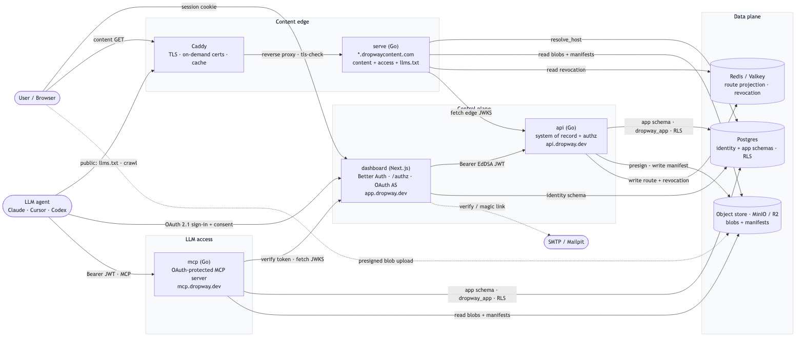

<!-- SPDX-License-Identifier: FSL-1.1-Apache-2.0 -->

# Dropway components & architecture (self-host)

How the runtime pieces fit together in a **self-hosted** Dropway: what each service
is responsible for, its main use cases, and which other services it calls. This is
the plain-Go / Docker-Compose topology (`deploy/docker-compose.yml`) — `serve` + Caddy
at the content edge, Redis/Valkey for the route projection, and MinIO for object
storage. (The hosted SaaS swaps these for the Cloudflare serving Worker, Workers KV,
and R2 respectively; component responsibilities are identical.)

Diagrams below are the pre-rendered PNGs in `docs/diagrams/`; the `.mmd` files there
are the source of truth.

## System diagram

## Request sequences (sign-up, sign-in, deploy, gated view, MCP)

---

## Components

### dashboard — `apps/dashboard` (Next.js)
The control-plane UI and the **identity authority**.

**Main use cases**
- Web UI to manage organizations, sites, deploys, members, domains, and the org's shared **skills** (author in a Markdown editor or drag-and-drop upload, edit a skill into a new version, search by folder/preset, download as zip, admin folder curation). Sites and skills also surface in the cross-user **feed** (vote, comment, share/unshare).
- **Authentication** via Better Auth: email/password, magic link, and (optional) Google SSO.
- The **OAuth 2.1 authorization server** for the CLI (`dropway login`) and MCP clients — DCR, authorize, consent (`/oauth/consent`), token.
- The **`/authz` edge-token exchange**: a gated-content viewer with a dashboard session is redirected here, and the dashboard asks the API to mint a host-scoped edge token.
- Owns + migrates the **`identity` schema** (user/session/account/verification/jwks/organization/member/invitation).
- Mints short-lived **EdDSA JWTs** (org_id claim) and publishes the **JWKS** the API + MCP verify against.

**Calls**
- **Postgres** — `identity` schema, over a privileged/owner connection (it CREATEs its own tables). Self-host wires this via `BETTER_AUTH_DATABASE_URL`.
- **api** — every business action, as a Bearer EdDSA JWT (the dashboard never touches the `app` schema directly).
- **SMTP** (e.g. Mailpit locally) — verification, magic-link, and password-reset mail; no-ops to logs when `MAIL_SMTP_URL` is unset, so a no-email self-host still works.

**Called by** users (session cookie); the CLI + LLM agents (OAuth); the api + mcp (fetch JWKS to verify tokens).

---

### api — `services/api` (Go)
The **system of record and the authorization boundary**. Every mutation goes through here.

**Main use cases**
- Owns + migrates the **`app` schema** (sites, versions, domains, allowlist, skills, skill_versions, skill_folders, skill_folder_items, post_votes, post_comments, org_meta, org_usage, audit_log) — accessed as the non-superuser, non-BYPASSRLS **`dropway_app`** role with per-request RLS tenant context.
- **Verifies every JWT** against the dashboard JWKS (pins EdDSA + iss + aud).
- The **deploy pipeline**: `prepare` (manifest → missing blobs + presigned PUT URLs) → client uploads → `finalize` (write manifest, insert version) → `publish` (flip `current_version_id`, write the route projection).
- **Org-wide skill sharing** (`/v1/skills`, `/v1/skill-folders`): the same prepare → presign → finalize upload contract (finalize publishes — skills are latest-only, each version carrying a monotonic number surfaced as the skill's `version` for update detection), admin-curated folders with preset flags, bulk folder download, and lazy per-org seeding of the default folders + starter presets (guarded by `org_meta.skills_seeded`).
- **Org feed** (`/v1/feed`): a unified newest-first list of shared sites **and** skills, each tagged by `kind`, with polymorphic votes + comments (`app.post_votes`/`app.post_comments` over a `subject_type` of `'site'`/`'skill'`) and per-post feed-visibility.
- **Mints host-scoped edge tokens** (`/v1/authz/mint`) for gated viewers, after checking membership/allowlist + revocation. Signs them with `EDGE_SIGNING_KEY` (stable Ed25519 seed) and publishes the edge JWKS at `/.well-known/edge-jwks`.
- Writes the **route projection** (`route:<host>`) and **revocation denylist** to the edge store.
- **ensure-org-provisioned**: lazily creates `app.org_meta` + `org_usage` for a tenant on first authenticated call.

**Calls**
- **Postgres** — `app` schema as `dropway_app` (RLS), via `DATABASE_URL`.
- **Object store** (MinIO) — presign uploads (`S3_*`), write deploy manifests.
- **Edge store** (Redis/Valkey) — write route projection + revocation.
- **dashboard JWKS** — verify incoming JWTs.

**Called by** dashboard, CLI, mcp (the write bridge), and `serve` (edge JWKS).

---

### mcp — `services/mcp` (Go)
The **OAuth-protected MCP server** that lets an LLM agent work with a tenant's deployed content, scoped to one org by the same RLS as everything else.

**Main use cases**
- Speaks **Streamable-HTTP MCP**; unauthenticated requests get a 401 + RFC 9728 pointer that starts the OAuth flow against the dashboard.
- **Read tools** (`list_sites`, `list_files`, `read_file`, `download_site`, `list_skills`, `download_skill`, `download_skill_folder`, `check_skill_updates`) — served directly from Postgres + the object store under RLS (no API hop).
- **Write tools** (`create_site`, `set_site_access`, `deploy_site`, `upload_skill`) — performed by **forwarding the user's OAuth token to the api** (which accepts the MCP audience), so writes reuse the API's authz, quota, projection, and audit. Requires `API_URL`; without it the server is read-only.
- Per-request **`org_meta.mcp_enabled`** kill-switch.

**Calls**
- **dashboard JWKS** — verify the Bearer token (iss/aud).
- **Postgres** — `app` schema as `dropway_app` (RLS) for reads + the mcp_enabled check.
- **Object store** (MinIO) — read manifests + blobs (org-scoped).
- **api** — write bridge for the mutating tools (forwards the user's token).

**Called by** LLM agents (Claude/Cursor/Codex) over MCP, after a browser OAuth 2.1 flow.

> Requires `MCP_PUBLIC_URL` (its own resource URL), `DATABASE_URL`, `JWKS_URL`, `DASHBOARD_URL`. The **api also needs `MCP_PUBLIC_URL`** so it accepts the forwarded MCP-audience token on write tools.

---

### serve — `services/serve` (Go) + Caddy · `*.<content-domain>`
The **content edge** for self-host: serves published sites and enforces access at the boundary. Caddy fronts it for TLS (on-demand certs) and caching; `serve` is read-only against its backends.

**Main use cases**
- Resolve `Host` → route (`resolve_host`) and stream published content from the object store.
- Enforce **access modes**: `public`, `password`, `allowlist`, `org_only`.
- For gated content with no/invalid edge cookie → **302 to the dashboard `/authz`**; on callback, verify the host-scoped `__Host-edge` token (against the API's edge JWKS, with revocation) and set the cookie.
- Serve **`llms.txt`** so LLM crawlers can discover public content.

**Calls**
- **Postgres** — `resolve_host` lookups.
- **Object store** (MinIO) — read blobs + manifests.
- **Edge store** (Redis/Valkey) — read revocation.
- **api edge JWKS** (`/.well-known/edge-jwks`) — verify edge tokens.

**Called by** end users (content GET, via Caddy) and LLM crawlers (public `llms.txt`). Holds no secrets.

---

### cli — `cli` (`dropway`)
The terminal client for deploys.

**Main use cases**
- `dropway login` — browser **OAuth 2.1** (PKCE + DCR) against the dashboard; a loopback `http://localhost:<port>/callback` catches the code; tokens stored + auto-refreshed.
- `dropway deploy <dir>` — folder → live URL via the API deploy pipeline (`--send` to upload; `--new --site <slug>` to create). Dry-run without `--send`.
- `dropway logout`.

**Calls** the **dashboard** (OAuth discovery/register/authorize/token) and the **api** (create site, prepare, upload presigned, finalize, publish). `DROPWAY_TOKEN` overrides login for CI.

---

## Data plane

### Postgres
- **`identity`** schema — Better Auth owns + migrates it (dashboard, privileged conn / `BETTER_AUTH_DATABASE_URL`).
- **`app`** schema — the api owns + migrates it (goose, run as the owner role); read/written as **`dropway_app`** (non-BYPASSRLS) under per-request RLS by both **api** and **mcp**.

### Object store — MinIO (`S3_*`)
Content-addressed **blobs** (`blobs/<org>/<sha256>`) + per-deploy **manifests** (`manifests/<org>/<site>/<version>.json`). Written by the **api** (and the **mcp** deploy bridge via the api); read by **api**, **mcp**, and **serve**. Note the internal vs browser-facing endpoint split (`S3_ENDPOINT` vs `S3_PUBLIC_ENDPOINT`) so presigned URLs resolve from both inside the compose network and the browser.

### Route / revocation store — Redis/Valkey
`route:<host>` projection, the revocation denylist (`revoked:*`), and per-org status (`org_status:<org>`). **api** writes; **serve** reads.

---

## Cross-cutting: tokens & trust
- The dashboard is the **only OAuth/JWT issuer** (EdDSA JWTs + JWKS). The **api** and **mcp** are verifiers; **serve** verifies a separate **edge token** signed by the api (`EDGE_SIGNING_KEY`) — the public content path carries no JWT.
- `JWT_ISSUER` / `JWT_AUDIENCE` must agree across dashboard + api; `MCP_PUBLIC_URL` must be byte-identical across dashboard, mcp, **and** api (the MCP write-bridge audience).
- Tenant isolation is enforced by **Postgres RLS** keyed on the token's `org_id`, not by application code — the api/mcp set the tenant context per request.

---

## Cross-cutting: error tracking
Every component reports caught + uncaught errors to a single error sink through a **vendor-neutral seam**, so the same failure surfaces the same way whether you run PostHog, another vendor, or nothing.

- **Go services (api, serve, mcp)** — `internal/errtrack` is the seam (the error analogue of `quota.Provider` / `projection.Writer`): a `Reporter` interface with a `Noop` default and a runtime-selected provider. Coverage is three mechanisms: a **slog bridge** (`WrapSlogHandler`) that mirrors every `slog.Error` to the sink (so `httpx.WriteError`'s 500 logging and all handler errors are captured with no call-site changes), an HTTP **`Recoverer`** that captures panics and returns a clean 500, and **`SafeGo`** for background goroutines. The shipped provider is PostHog (`internal/errtrack/posthog.go`, the official `posthog-go` SDK). Self-hosters can `Register` a Datadog/Sentry/OTLP `Reporter` under their own `ERROR_TRACKING_PROVIDER` name with no call-site changes.
- **dashboard** — the browser SDK autocaptures unhandled errors + promise rejections (`capture_exceptions`); server errors flow through Next's `instrumentation.ts` `onRequestError` hook into `captureServerException` (the TS seam in `lib/analytics-server.ts`), which uses `captureExceptionImmediate` so an event is never lost to a Vercel function freeze.
- **serve worker (`edge/serving-worker`)** — the `fetch` entry wraps `serve()` and reports any unexpected throw via `src/errtrack.ts` (a `$exception` POST, best-effort off the response path).
- **Config** — `POSTHOG_KEY` (the same key the edge worker + dashboard use), `POSTHOG_HOST`, `ENVIRONMENT`, and optional `ERROR_TRACKING_PROVIDER`. Unset key ⇒ no reporting (the OSS/self-host default). The CLI is intentionally excluded (it runs on end-user machines).

_See `deploy/docker-compose.yml` and `deploy/README.md` for the self-host wiring, and `docs/diagrams/` for the schema diagrams (`schema-app`, `schema-identity`, `schema-billing`)._
