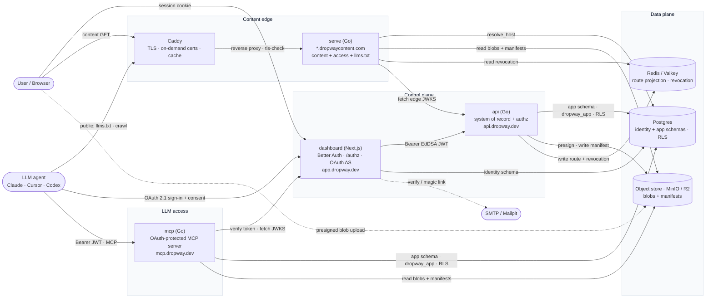
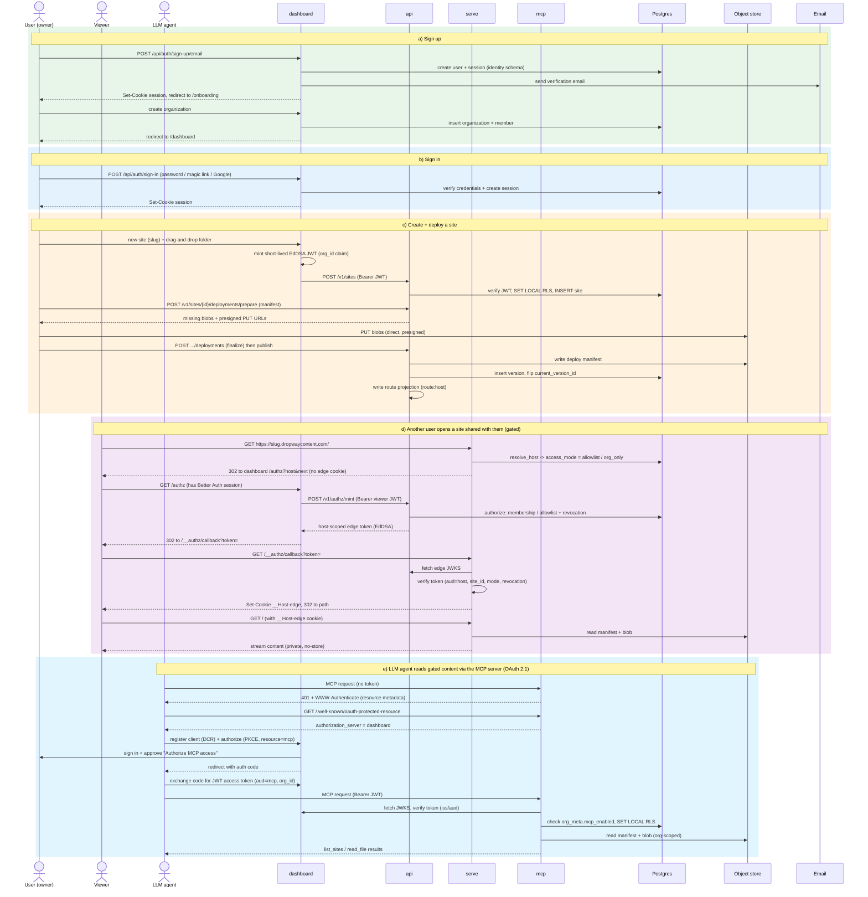

<!-- SPDX-License-Identifier: FSL-1.1-Apache-2.0 -->

# Dropway — system diagrams

Diagrams-as-code (Mermaid). The `.mmd` files are the source of truth; the `.png`
files are pre-rendered for quick viewing. GitHub renders the fenced `mermaid`
blocks below natively.

## 1. Components & directional requests

How the runtime pieces talk to each other. `serve` is the self-host content edge
(the plain-Go alternative to the Cloudflare serving Worker); Redis/Valkey holds the
route projection + revocation denylist (`api` writes, `serve` reads). `mcp` is the
OAuth-protected MCP server: an LLM agent reads **public** content as a crawler (via
`llms.txt` on the edge) and **gated** content only through `mcp`, after a browser
OAuth flow against the dashboard (the authorization server) — scoped to one org by
the same RLS as the rest of the platform.




## 2. Sequence flows

(a) sign up · (b) sign in · (c) create + deploy a site · (d) another user opening a
site shared with them (the gated edge-token exchange) · (e) an LLM agent reading gated
content through the MCP server (the OAuth 2.1 flow).




## Regenerating the PNGs

The `.mmd` files are the source. Render them with the Mermaid CLI:

```sh
npx -y @mermaid-js/mermaid-cli -i components.mmd -o components.png -s 2 -b white
npx -y @mermaid-js/mermaid-cli -i sequence.mmd   -o sequence.png   -s 2 -b white
```

Edit the `.mmd` (and keep the fenced blocks above in sync), then re-render.
