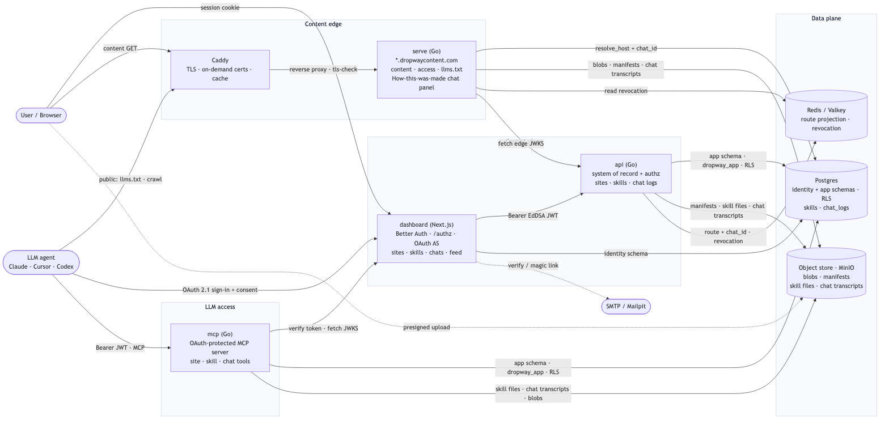
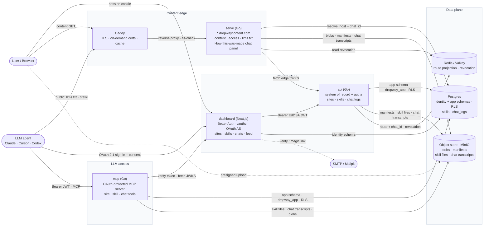
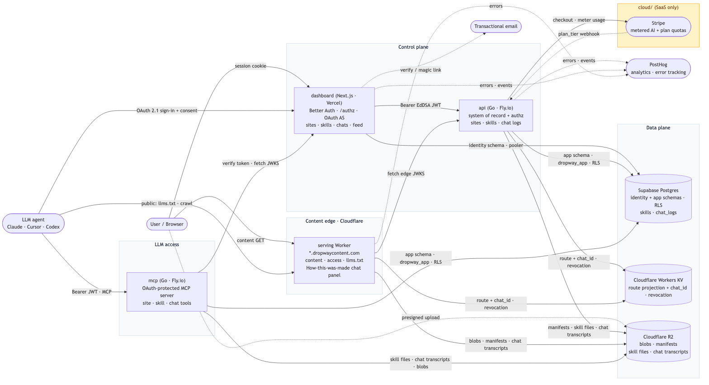
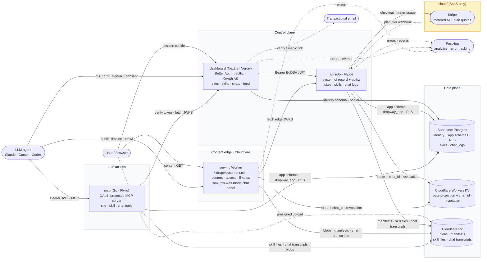
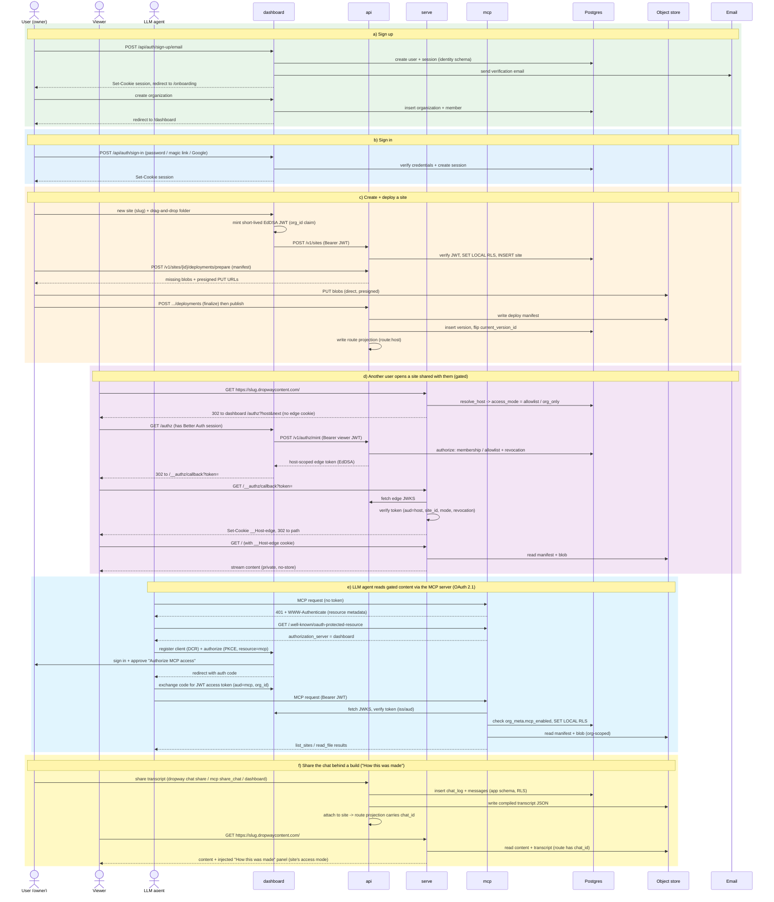

<!-- SPDX-License-Identifier: FSL-1.1-Apache-2.0 -->

# Dropway system diagrams

Diagrams-as-code (Mermaid). The `.mmd` files are the source of truth; the `.png`
files are pre-rendered for quick viewing. GitHub renders the fenced `mermaid`
blocks below natively.

## 1. Components & directional requests

How the runtime pieces talk to each other. The **components are identical across
self-host and the hosted SaaS**; only the infrastructure they run on differs, so
there are two versions of this diagram. In both, `mcp` is the OAuth-protected MCP
server: an LLM agent reads **public** content as a crawler (via `llms.txt` on the
edge) and **gated** content only through `mcp`, after a browser OAuth flow against
the dashboard (the authorization server), scoped to one org by the same RLS as the
rest of the platform. Org-shared **skills** and **chat logs** (the "How this was
made" panel served on a site) travel the same paths: the `api` is the system of
record and the object store holds skill files + compiled chat transcripts, which
`mcp` reads under RLS and the edge injects into served pages.

### 1a. Self-host (Docker Compose)

`serve` is the plain-Go content edge behind Caddy; Redis/Valkey holds the route
projection + revocation denylist (`api` writes, `serve` reads revocation, and
resolves the route — with its `chat_id` — from Postgres); MinIO is the object store.
No billing (self-host is unlimited).





### 1b. Hosted SaaS (cloud)

The hosted build swaps the edge for the Cloudflare serving Worker (route projection
+ revocation in Workers KV, blobs/manifests/transcripts in R2), runs the dashboard
on Vercel and `api`/`mcp` on Fly.io against Supabase Postgres, and adds the
`cloud/` billing module: `api` drives **Stripe** for checkout + metered AI usage and
plan quotas, with a signed webhook writing `plan_tier` back. Errors and events flow
to PostHog.





## 2. Sequence flows

(a) sign up, (b) sign in, (c) create and deploy a site, (d) another user opening a
site shared with them (the gated edge-token exchange), (e) an LLM agent reading
gated content through the MCP server (the OAuth 2.1 flow), and (f) sharing the chat
behind a build as a site's "How this was made" panel. Sharing a **skill** reuses the
(c) deploy contract (prepare → presigned upload → finalize), so it isn't drawn
separately.




## Regenerating the PNGs

The `.mmd` files are the source. Render them with the Mermaid CLI:

```sh
npx -y @mermaid-js/mermaid-cli -i components-selfhost.mmd -o components-selfhost.png -s 2 -b white
npx -y @mermaid-js/mermaid-cli -i components-cloud.mmd    -o components-cloud.png    -s 2 -b white
npx -y @mermaid-js/mermaid-cli -i sequence.mmd            -o sequence.png            -s 2 -b white
```

Edit the `.mmd` (and keep the fenced blocks above in sync), then re-render.
